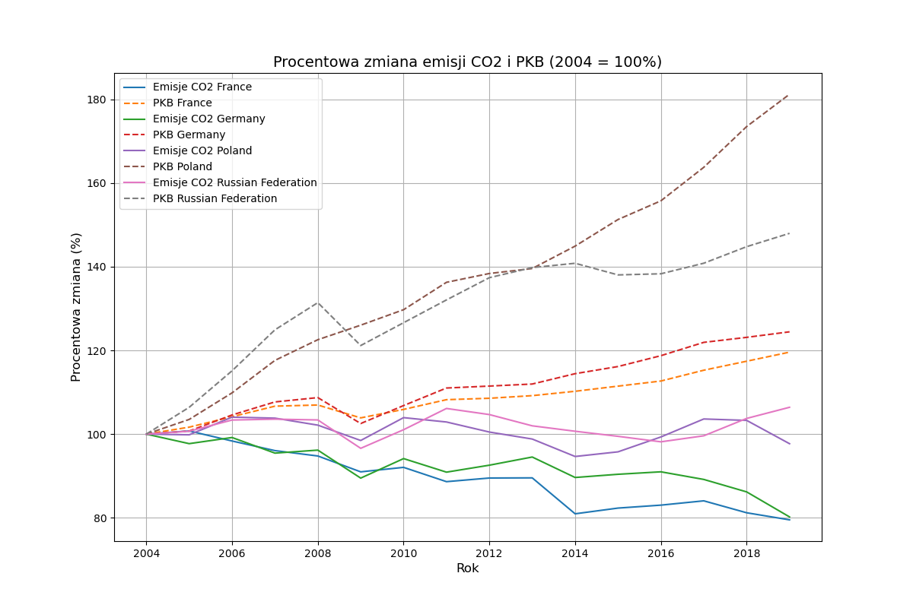
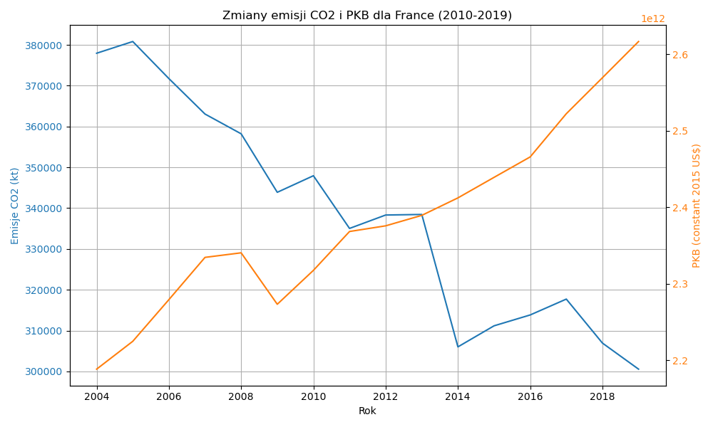

# Co2 Emission and GDP Correlation (2004-2019)

## Overview

This project analyzes the relationship between CO2 emissions and the Gross Domestic Product (GDP) for selected countries between the years 2004 and 2019. The goal is to visualize and identify trends, correlations, and insights into how CO2 emissions relate to economic growth across various countries.

## Project Structure

```
.
├── charts                     # Visualizations and charts
├── correlation_results         # Results of correlation analysis
├── data                        # Raw and transformed data used for analysis
│   ├── raw                     # Raw data files
│   └── transformed             # Transformed data files used in analysis
├── scripts                     # Python scripts for data processing and visualization
│   ├── compraison_chart.py     # Script for comparing CO2 and GDP changes over time
│   ├── correlation.py          # Script for computing correlations between variables
│   ├── filteringavg.py         # Script for filtering and calculating moving averages
│   └── line_chart.py           # Script for generating line charts of CO2 and GDP trends
└── README.md                   # Project documentation (this file)
```

## Data Sources

The data used in this project comes from the **World Bank’s World Development Indicators (WDI)**. It includes information on:

- **CO2 emissions (kt)**
- **CO2 emissions per capita (metric tons)**
- **CO2 emissions from transport (% of total fuel combustion)**
- **CO2 intensity (kg per kg of oil equivalent energy use)**
- **GDP (constant 2015 US$)**

You can obtain the raw data files from public datasets like the World Bank and other open data sources.

## Installation

### Prerequisites

Ensure that you have Python 3.x and the following packages installed:

- `pandas`
- `matplotlib`
- `seaborn`
- `numpy`

To install the required packages, you can use the following command:

### Running the Scripts

1. **Data Preparation:**

   Before running the analysis scripts, ensure that the raw data is placed in the `data/raw` folder. The data should be formatted correctly to align with the structure used in the scripts.

2. **Correlation Analysis:**

   To compute the correlation between CO2 emissions and GDP for the selected countries:

   ```bash
   python scripts/correlation.py
   ```

   The results will be saved in the `correlation_results` folder as CSV files and charts.

3. **Comparison Visualization:**

   To visualize and compare the percentage change of CO2 emissions and GDP across countries:

   ```bash
   python scripts/comprasison_chart.py
   ```

   The output will be a line chart showing the trends for all countries between 2004 and 2019.

## Key Results

- **Correlation Analysis:** The correlation results between CO2 emissions and GDP for France, Germany, Poland, and the Russian Federation show varying relationships. For some countries, as GDP rises, emissions decrease, while for others, the relationship is more direct.
  
- **Trend Analysis:** Using line charts, the trend of CO2 emissions and GDP growth can be observed, highlighting significant differences between the countries.

## Example Visualizations

- **CO2 Emission vs. GDP Comparison:**

  

- **Country-specific CO2 Emissions:**

  


This `README.md` provides an overview, instructions for running the scripts, and a description of the project structure. Let me know if you'd like to customize or add more details!
